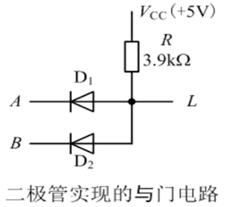
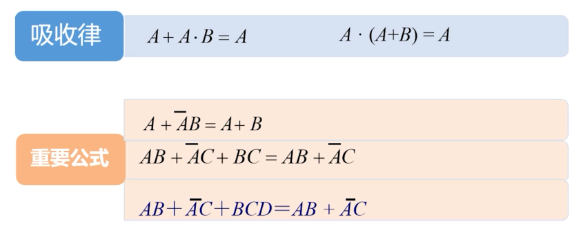
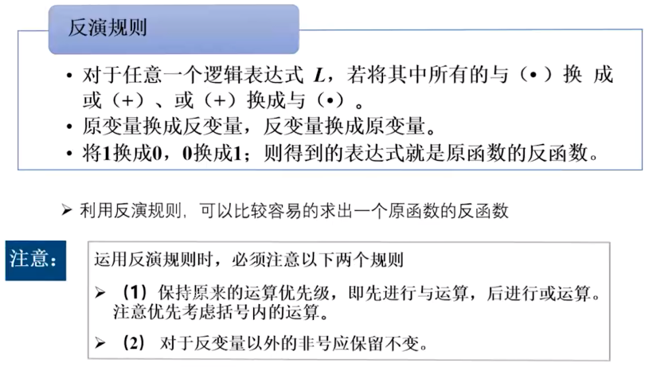
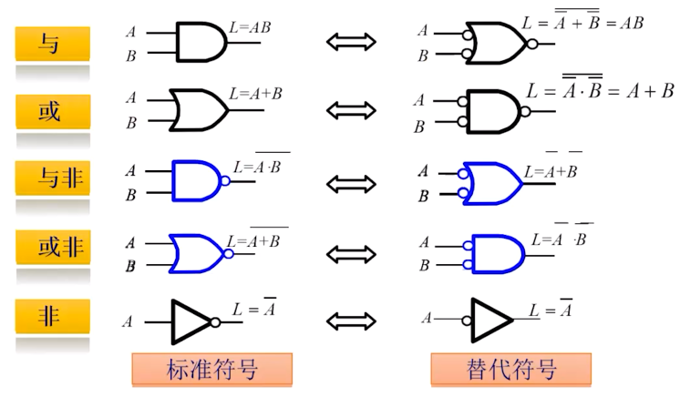

<!--
 * @Author: shysgsg 1054733568@qq.com
 * @Date: 2025-02-28 14:48:48
 * @LastEditors: shysgsg 1054733568@qq.com
 * @LastEditTime: 2025-03-03 21:03:07
 * @FilePath: \IC修真院\IC前端\数电基础.md
 * @Description: 这是默认设置,请设置`customMade`, 打开koroFileHeader查看配置 进行设置: https://github.com/OBKoro1/koro1FileHeader/wiki/%E9%85%8D%E7%BD%AE
-->
# 数电基础

## 数字信号描述方法

- 信号分类
  - 模拟电信号
  - 数字电信号  
- 数字信号描述方法
  - 二值逻辑
  - 逻辑电平（CMOS器件0-1.5V为低电平，3.5-5V为高电平）
  - 数字波形（三值逻辑波形）
  - 实际脉冲波形：脉冲幅值、上升时间（10%-90%）、下降时间、周期、脉冲宽度、占空比
</br>

## 数制与码制

- 各种进制（位权制）
  - 怎么计算
  - 数制转换
  - 算数运算
- 有符号数
  - 原码、反码、补码
- 码制：编码的规制
  - BCD码：8421、2421、5421、余三码、余三循环码
  - 格雷码：格雷码是循环码、反射码
  - 构造格雷码：递归、从二进制码转换（从左到右相邻两位相加舍弃进位）
  - 注意：数制转换与码制转换（编码）的区别
  - ASCII码
  - 奇偶校验码：只能检验错误（单个），不能纠正错误
</br>

## 逻辑代数（布尔代数）

- 概念：逻辑变量、逻辑常量、逻辑运算
- 与、或、非、与非、或非、异或、同或
  
- 三态门：加了一个使能端
- 集成逻辑门：简介、传输延迟
- 定律：01律、重叠律、互补律、还原律、交换律、结合律、分配律、反演律（德摩根律）、吸收律
  
- 规则：带入规则、反演规则、对偶规则
  
- 逻辑函数及其表示方法：与或表达式（最小项表达式）、或与表达式（最大项表达式）、化简、变换
- 逻辑函数的最小项表达式和最大项表达式
- 卡诺图、卡诺图化简、含无关项的卡诺图
- 逻辑门的替代符号
  
</br>

## 组合逻辑电路分析、设计与优化   
### 总体概念
- 列真值表、化简逻辑表达式（可使用卡诺图、大型工程上的优化由EDA工具完成）、转换为门电路
- 与非门中MOS管最少
- 竞争冒险
  - 竞争:当一个逻辑门的两个输入端的信号同时向相反方向变化，而变化的时间有差异的现象。
  - 冒险:两个输入端的信号取值的变化方向相反时，如门电路输出端的逻辑表达式简化成两个互补信号相乘或者相加，由竞争而可能产生输出干扰脉冲的现象。
  - 消除竞争冒险
    - 加冗余项
    - 输出端并联电容

### 编码器与译码器
#### 编码器
- 编码：赋予二进制代码特定含义的过程
- 分类：普通编码器、优先编码器
```v
module priority_encoder_8to3 (
    input wire [7:0] in,  // 8 位输入信号
    output reg [2:0] out  // 3 位编码输出
);

always @(*) begin
    if (in[7])      // 最高优先级输入
        out = 3'b111;
    else if (in[6])
        out = 3'b110;
    else if (in[5])
        out = 3'b101;
    else if (in[4])
        out = 3'b100;
    else if (in[3])
        out = 3'b011;
    else if (in[2])
        out = 3'b010;
    else if (in[1])
        out = 3'b001;
    else if (in[0])
        out = 3'b000;
    else
        out = 3'bxxx; // 所有输入都为低电平时，输出为不确定值
end

endmodule
```
#### 译码器
- 2-4译码器
```v
module decoder_2to4 (
    input wire [1:0] in,  // 2 位输入信号
    output reg [3:0] out  // 4 位输出信号
);

always @(*) begin
    case (in)
        2'b00: out = 4'b0001;
        2'b01: out = 4'b0010;
        2'b10: out = 4'b0100;
        2'b11: out = 4'b1000;
        default: out = 4'bxxxx;
    endcase
end

endmodule
```
- 七段数码管显示译码
```v
module seg7_decoder (
    input wire [3:0] bcd_in,  // 4 位 BCD 码输入
    output reg [6:0] seg_out  // 七段数码管输出，seg_out[0] 对应 a 段，seg_out[1] 对应 b 段，以此类推
);

always @(*) begin
    case (bcd_in)
        4'b0000: seg_out = 7'b1000000; // 显示数字 0
        4'b0001: seg_out = 7'b1111001; // 显示数字 1
        4'b0010: seg_out = 7'b0100100; // 显示数字 2
        4'b0011: seg_out = 7'b0110000; // 显示数字 3
        4'b0100: seg_out = 7'b0011001; // 显示数字 4
        4'b0101: seg_out = 7'b0010010; // 显示数字 5
        4'b0110: seg_out = 7'b0000010; // 显示数字 6
        4'b0111: seg_out = 7'b1111000; // 显示数字 7
        4'b1000: seg_out = 7'b0000000; // 显示数字 8
        4'b1001: seg_out = 7'b0010000; // 显示数字 9
        default: seg_out = 7'b1111111; // 非法输入时，七段全灭
    endcase
end

endmodule
```


